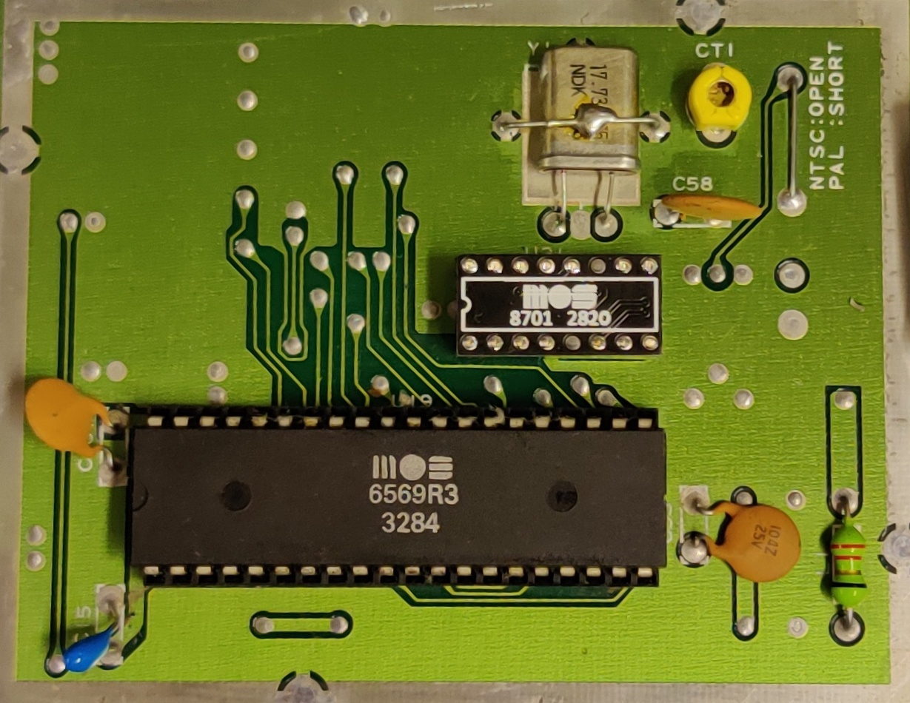
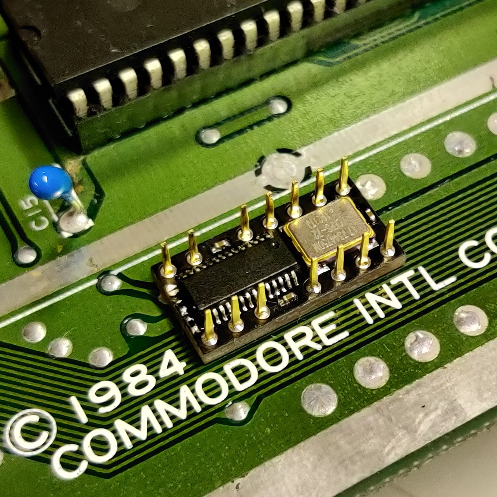

    

# neat8701
neat8701 is a MOS 8701 IC replacement circuit for Commodore 64. 8701 is used in 250425, 250466 and 250469 motherboard versions. There are many other similar circuits available. My goal was to fit all components on the bottom side including an optional oscillator. The use of the optional oscillator bypassses the crystal and adjustable capacitor on the Commodore 64 motherboard.

    

Assembly instuctions can be found HERE. 

Gerbers for ordering the PCBs are available [HERE.](https://github.com/1c3d1v3r/neat8701/blob/main/gerbers/neat8701.zip) 

HTML BOM can be found [HERE.](https://htmlpreview.github.io/?https://github.com/1c3d1v3r/neat8701/blob/main/BOM/neat8701.html)

### Licence

neat8701 by <a rel="cc:attributionURL dct:creator" property="cc:attributionName" href="https://github.com/1c3d1v3r/">Pasi Lassila</a> is licensed under <a href="http://creativecommons.org/licenses/by-sa/4.0/?ref=chooser-v1" target="_blank" rel="license noopener noreferrer" style="display:inline-block;">CC BY-SA 4.0</a>

